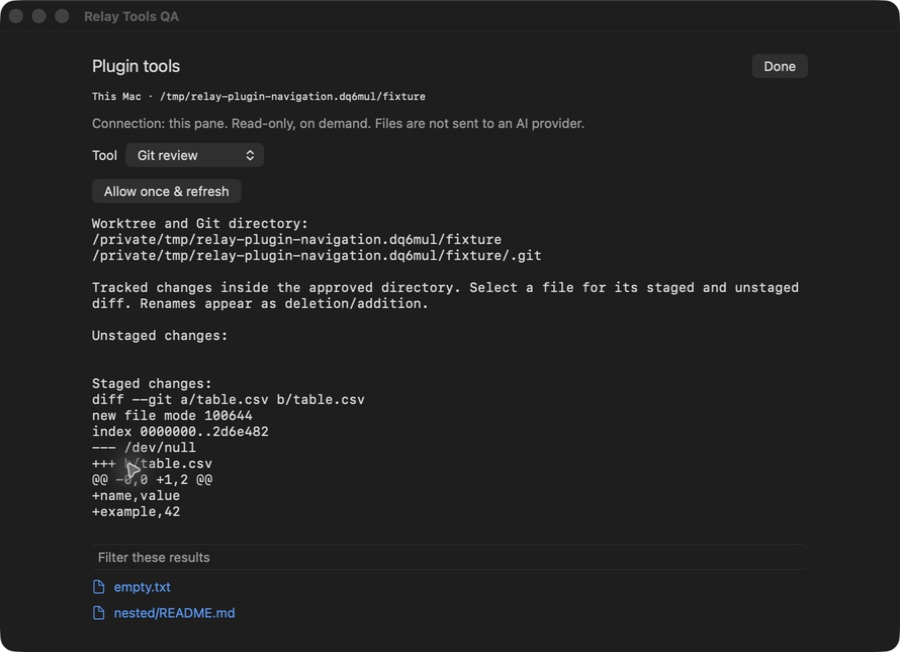

# Relay Git review

Inspect tracked changes without modifying the repository or Git index.

*Actual native Relay component captured September 19, 2026 in an isolated test window. Synthetic data only. Development preview—not a promise that these features are in the released app.*

## Status

This repository has an experimental API-2 manifest but **no tagged installable release yet**. Do not use `main` as a release tag.

Features and screenshots here describe the current Relay development implementation. A compatible app and matching helper are required; installed-app and release acceptance remain incomplete.

This is a **data-only package**. Its manifest selects operations implemented in [Relay](https://github.com/genomewalker/relay-terminal). It does not download executable plugin code, run install hooks or add background polling.

## Features

- Changed-file listing before fetching patches.
- Local filename filter and per-file staged/unstaged diffs.
- Worktree and Git-directory attribution.
- Deleted-file handling and literal pathspec-like filenames.

## Install

Wait for a tagged release before installing this package.

1. Use a compatible Relay app and matching `relayd` on the target host.
2. Open **Settings → Plugins**, enter `genomewalker/relay-plugin-git-review` and the exact released tag.
3. Review the repository, digest and permissions. Install, then explicitly Enable.
4. Select the intended terminal pane and click the puzzle-piece toolbar button.

Updates require another review and start disabled. Disable, Roll back and Uninstall are available in Settings. Safe mode suppresses plugin tools. Existing release assets must not be overwritten.

## Use

Refresh the list, filter if needed, then click a file to load its diff. These operations do not write the index.

The panel captures its originating pane and connection; changing tabs does not retarget a request. File tools need a known working directory. Reopen the panel from the intended directory when necessary. Each read is explicit; active terminal workers and agents are not restarted.

## Permissions and safety

`projectRead`: scoped Git inspection. External diff programs, textconv and filesystem-monitor hooks are disabled for these operations.

Relay checks the enabled package and digest before running and before showing results. An incompatible helper produces an error, not a misleading empty result.

## Limits and remaining work

Up to 500 files; displayed text is limited to 128 KiB. Per-command output is bounded to 1 MiB. Renames are shown as deletion/addition to preserve directory boundaries. No untracked contents, staging, commits, editor/agent handoff or submodule traversal.

## Verification

Listing, filtering and a selected staged diff were checked manually. Backend tests cover subdirectory isolation, hostile Git environment, deleted files and unusual literal names.

The latest combined development run reported 216 Swift tests (one optional network test skipped); the Go race suite passed. These checks do not substitute for installed-app, remote-error, accessibility or release acceptance of the exact versions you deploy.

## Development and issues

Validate the manifest with `python3 -m json.tool relay-plugin.json`. Native implementation and tests live in [Relay](https://github.com/genomewalker/relay-terminal), not this repository. Report runtime problems there with app/helper versions, reproduction steps and redacted diagnostics. Manifest and documentation issues belong here.

No license has been selected for this package yet. Public visibility alone does not grant a reuse license.
